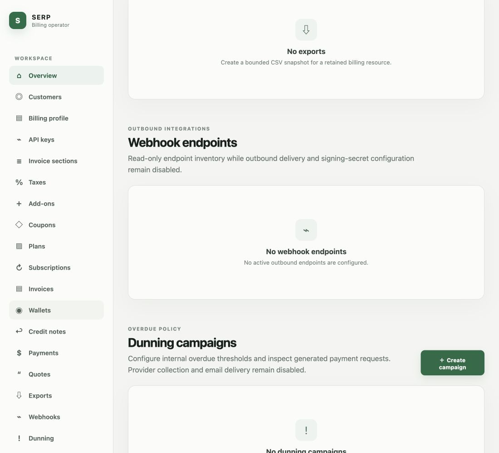
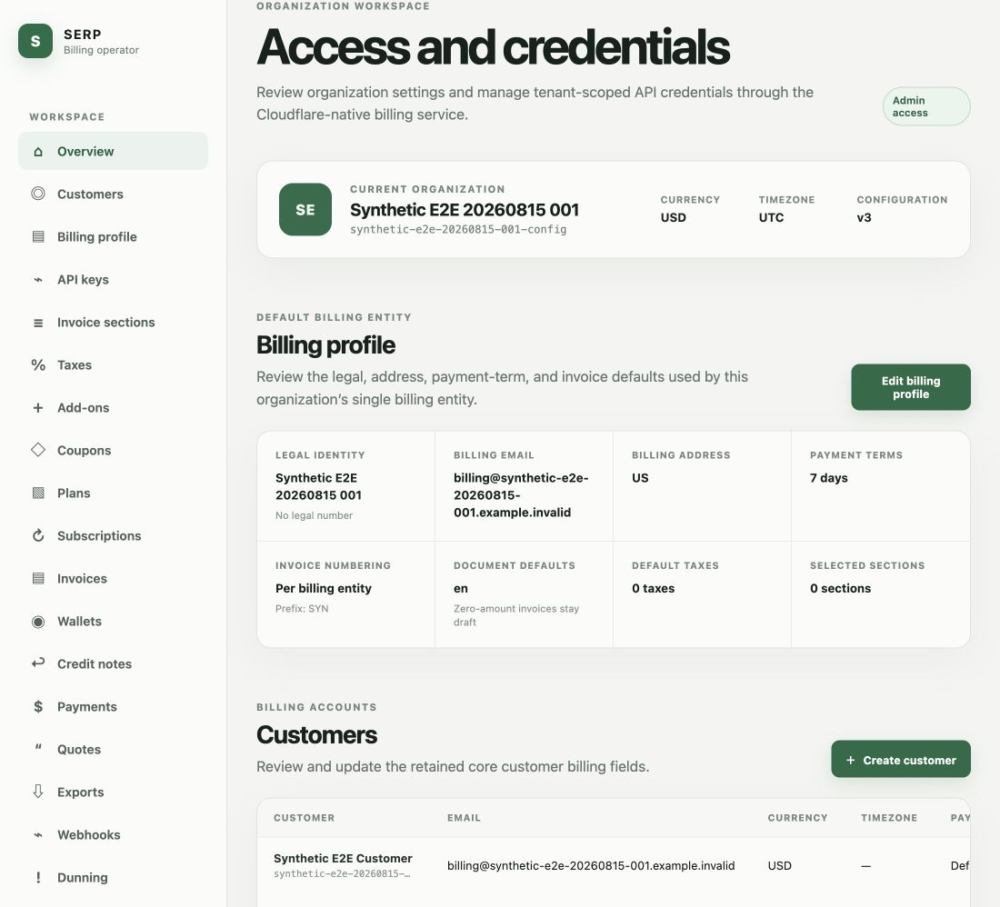

# Lago Cloudflare Operator UI Parity Audit

## Scope

Compare the deployed Cloudflare operator shell with the checked-in Lago frontend's established
information architecture, especially organization switching, navigation, and page layout. This is
a structural audit; colors and brand styling are secondary.

## User goal

Operate the Cloudflare-native billing system through the familiar Lago product structure while
preserving the fork's multi-organization behavior and retained premium workflows.

## Step 1 — Open a named operator destination

Health: **Broken structurally.** `#quotes` is an anchor in one long document rather than a page.
The captured viewport shows exports, webhooks, and dunning instead of a focused Quotes page. The
sidebar can show multiple active-looking items as the document scroll position changes.

## Step 2 — Return to overview

Health: **Functional but not Lago-parity.** The page loads synthetic tenant data and actions, but
the overview immediately continues into billing profile, customers, and every other feature. It
does not provide the original route-level page header, focused content region, breadcrumbs, tabs,
or filters.

## Strengths

- Cloudflare Access and the tenant-scoped REST BFF are working.
- The current UI has semantic regions, tables, headings, a skip link, and explicit empty states.
- Retained operations are visible and the synthetic tenant is clearly identified.

## UX risks

1. **The original page model was discarded.** The deployed app is a single document with 19 anchor
   links. The original frontend uses route-level pages inside `MainNavLayout`, with a dedicated
   `MainHeader` for entity titles, actions, tabs, filters, and breadcrumbs.
2. **Multi-organization UX is absent.** The original `OrganizationSwitcher` derives the current
   organization from the URL slug and lets a user switch among memberships. The current header
   hard-codes one resolved membership and provides no switcher.
3. **The operator schema is single-organization per Access identity.** Migration 0070 makes
   `(access_issuer, access_subject_sha256)` globally unique, and authentication selects one row with
   `LIMIT 1`. This prevents the original many-membership model even if a switcher were added.
4. **Navigation hierarchy is flattened.** The original shell groups Reports, Configuration, and
   Billing & operations, with Settings and Developer tools anchored at the bottom. The current
   shell presents every retained feature in one ungrouped Workspace list.
5. **No focused working context.** Tables, empty states, profile panels, and actions for unrelated
   domains are all loaded together. This makes scanning harder and causes deep-link behavior to be
   unreliable.
6. **The existing design system was bypassed.** The original Lago components, spacing model,
   responsive navigation, icons, headers, and interaction patterns remain in the repository but
   were replaced with a separate handwritten HTML/CSS system.

## Accessibility risks

- The giant document creates an unnecessarily long reading and keyboard order.
- Hash navigation changes scroll position but does not create a true page or consistently announce
  a route change to assistive technology.
- Symbol characters are used as icons instead of the checked-in Lago icon system.
- Screenshot evidence cannot confirm keyboard focus visibility, screen-reader announcements, zoom
  reflow, or modal focus trapping; those require interactive testing after the shell is corrected.

## Corrective direction

1. Keep the deployed Worker, D1 model, Access gate, REST contracts, tests, and synthetic data.
2. Add a migration that permits one Access subject to hold memberships in multiple organizations.
3. Return the membership list and selected organization from the operator session contract.
4. Restore organization-slug routes and the original organization-switching behavior.
5. Rebuild the Cloudflare Static Assets frontend around the checked-in Lago navigation shell and
   design-system components, replacing Apollo calls with the existing REST BFF rather than replacing
   the product layout.
6. Convert each retained anchor section into a focused route with the original page-header,
   action, tab, filter, table, detail, empty, loading, and error patterns.
7. Treat unsupported operations as disabled or unavailable within the familiar page instead of
   removing the page hierarchy.

## Evidence limits

The deployed operator was captured directly in the current authenticated browser. The original Lago
frontend was inspected from its checked-in source (`MainNavLayout`, `OrganizationSwitcher`,
`MainNavMenuSections`, `MainHeader`, `NavLayout`, and design-system components) but was not started
against a legacy backend for this audit, so no fresh original-runtime screenshot is claimed.

## Remediation verification — 2026-08-18

The structural findings above describe the superseded implementation that triggered this audit.
The corrected operator now uses focused organization-slug routes, grouped Lago navigation, a
multi-membership organization switcher, list/detail pages, original SVG assets, and the established
Lago page/dialog spacing model. The five mistakenly omitted product surfaces are executable:

- Analytics retains Revenue streams, MRR, Usage, Prepaid credits, and Invoices tabs, date filters,
  customer/plan/collection breakdowns, and a deep-linkable billable-metric usage view.
- Forecasts exposes bounded 3/6/12-month scenario projections.
- Billable metrics exposes list/detail/create/edit/delete/duplicate and activity history.
- Features exposes typed privilege CRUD, activity history, and plan entitlement assignment.
- Lago Assistant uses the original 48px right rail and 360–420px desktop panel, with an overlay at
  narrower desktop widths so the underlying Lago detail layout is not crushed, plus
  membership-and-organization-scoped D1 history and a read-only Workers AI stream.

New visual evidence:

- `18-plan-feature-entitlements.png` — plan editor with the restored Features section.
- `19-analytics-mrr-parity.png` — functional MRR tab in the corrected Lago shell.
- `20-ai-assistant-panel.png` — pushed right-side assistant panel alongside Analytics.

Interactive checks covered direct/reloaded Analytics tab and usage-metric URLs, Forecast rows,
billable-metric and feature details, outbox-backed activity, metric duplication, plan entitlement
values, assistant open/close and streaming in the synthetic preview, and deployed authenticated
navigation. The deployed worker showed each new route without the unavailable panel. Fresh
unauthenticated root and session requests were intercepted by Cloudflare Access before origin.

## Final parity-repair verification — 2026-08-18

The continuation pass treated the operation ledger as a coverage index rather than visual proof.
Fresh local browser QA at 1280 × 720 and 390 × 844 verified the rebuilt product surfaces against
the checked-in Lago source and existing side-by-side evidence.

- All 29 visible primary-navigation destinations rendered focused Lago pages; none showed the old
  `Cloudflare boundary`, page-unavailable, or operator-unavailable panels.
- Analytics, Forecasts, Billable metrics, and Features render real charts, tables, filters, CRUD
  entry points, and typed feature privileges instead of placeholder cards.
- The customer Settings tab now exposes document locale, issuing-date policy, zero-amount invoice
  policy, dunning, applied taxes, invoice custom sections, and dependency-safe deletion.
- Subscription, invoice, credit-note, and billing-profile details expose the newly retained policy,
  metadata, adjusted-fee, document, tax, dunning, and logo controls.
- The Lago Assistant opens from its right rail on desktop and as a full-screen mobile surface. A
  responsive defect that compressed customer details at 1280px was corrected during this pass.
- Viewer membership controls remain disabled in the second synthetic organization.
- Browser QA found and fixed an organization-prefixed legacy-route defect. Original paths such as
  `/serp-billing/customer/tammy` now canonicalize to the retained customer detail, while canonical
  detail URLs continue to preserve their identifier.

Final visual evidence:

- `21-final-customers-desktop.png`
- `22-final-customer-settings-ai.png`
- `23-final-analytics.png`
- `24-final-forecasts.png`
- `25-final-billable-metrics.png`
- `26-final-features-privileges.png`
- `27-final-mobile-customers.png`
- `28-final-mobile-assistant.png`
- `29-deployed-customer-settings-ai.png`

The local acceptance gate passed 358 tests across 65 files, all 80 migrations replayed from a
fresh D1 directory, generated binding types were current, and API/operator/portal Wrangler dry-run
bundles succeeded. Migrations `0074` through `0080` were then applied to the isolated development
D1 database, leaving no pending migration. Operator version
`64287259-a894-4fcb-bdfd-274e3d01ae83` and customer-portal version
`6bfeedea-636d-4af4-bcf0-3e20573ab3a0` were deployed. Fresh unauthenticated operator root and
session requests received Access `302`; the public portal root returned `200` and a tokenless portal
session returned `401 portal_unauthorized`. Authenticated browser QA loaded the synthetic customer
Settings page and Lago Assistant from the deployed operator.
